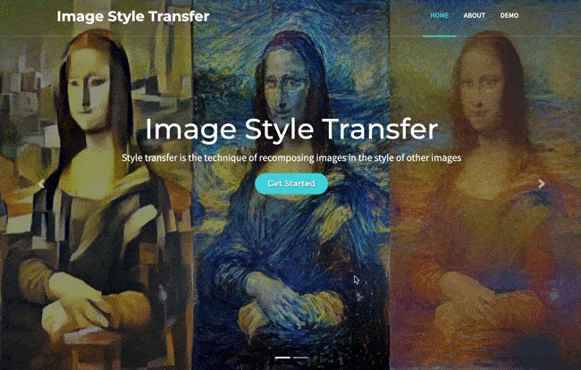

## Style Transfer
This repository contains an implementation of arbitrary style transfer running fully inside the browser using TensorFlow.js.

 
## Reference
- [Fast style transfer for ANY style in the browser with TF.js](https://www.reddit.com/r/MachineLearning/comments/9yjhm6/p_fast_style_transfer_for_any_style_in_the/)
- [arbitrary style transfer paper](https://arxiv.org/abs/1705.06830)

- [Neural style transfer TF](https://www.tensorflow.org/tutorials/generative/style_transfer)